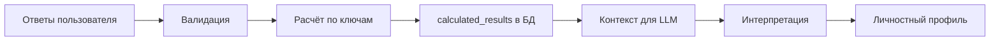
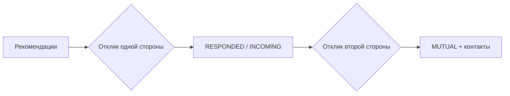

# ProCrush

Платформа подбора кандидатов: соискатель проходит личностные опросы, получает интерпретированный профиль; работодатель создаёт профили вакансий и просматривает кандидатов.

## Логика работы сервиса

### Роли

После входа пользователь один раз выбирает роль (`SEEKER` или `EMPLOYER`) через `POST /api/auth/complete-registration`. Сменить роль нельзя.

| Роль | Возможности |
|------|-------------|
| **Соискатель (SEEKER)** | Проходит группы личностных тестов, получает интерпретированный профиль, указывает желаемые профессии, просматривает рекомендации вакансий и откликается на них |
| **Работодатель (EMPLOYER)** | Ведёт профиль компании и профили вакансий, просматривает рекомендованных кандидатов с оценкой совпадения и откликается на них |

### Группы тестов

Опросы делятся на две группы:

1. **Тест 1 (`core`)** — восемь последовательных методик (открытые вопросы, выбор качеств, DISC, дилеммы, Белбин и др.). Шаги можно пересматривать, пока вся группа не завершена.
2. **Тест 2 (`64qn`)** — личностный опросник на 64 вопроса (шкала 0–4). Открывается только после полного завершения группы `core`.

Правила блокировки и навигации между шагами реализованы на бэкенде — см. [backend/README.md](./backend/README.md).

### Цепочка «тесты → расчёты → интерпретация»

**1. Тесты.** Соискатель отвечает на вопросы в веб-клиенте. Ответы сохраняются по мере заполнения; при завершении опроса сервер проверяет полноту и корректность.

**2. Расчёты.** Для каждого опроса в БД хранятся ключи подсчёта. Сервер применяет нужную логику (`open_text`, `matrix`, `direct_sum`, `formula`) и записывает структурированный JSON в `survey_results.calculated_results`. Примеры: суммы по осям DISC, роли Белбина, нормализованные баллы шкалы 0–4.

**3. Интерпретация.** Когда завершены обе группы тестов, API ставит задачу в очередь; отдельный процесс **personality** забирает задачу и вызывает LLM:

- собирается контекст: ответы, результаты расчётов и глоссарий терминов;
- LLM получает системный промпт с требуемой JSON-схемой;
- ответ валидируется и сохраняется как личностный профиль.

Статусы профиля: `NOT_READY` → `PROCESSING` → `READY` или `FAILED` (с возможностью повтора). Готовность профиля уведомляется клиенту в реальном времени (SSE).

### Матчинг и отклики

После завершения обеих групп тестов соискатель указывает желаемые профессии. Работодатель создаёт профили вакансий с привязкой к профессии, навыкам и ожидаемым личностным осям.

**Рекомендации.** Отдельный сервис **matching** — единственный источник рекомендаций: API читает их по HTTP. Пары «соискатель ↔ вакансия» подбираются в рамках совпадающей профессии; оценка совпадения — доля пересечения навыков (Jaccard) и, если у соискателя готов личностный профиль, сходство по осям личности (50/50). Списки сортируются по убыванию score.

| Сторона | Список рекомендаций |
|---------|---------------------|
| Соискатель | `GET /api/seeker/recommendations` — вакансии по желаемым профессиям |
| Работодатель | `GET /api/employer/job-profiles/{id}/candidates` — кандидаты для вакансии |

**Отклики.** Любая сторона может первой выразить интерес; отклик необратим. Статус хранится в `job_match_interests` и вычисляется для каждой стороны отдельно:

| Статус | Для инициатора | Для получателя |
|--------|----------------|----------------|
| `NONE` | Отклика не было | — |
| `RESPONDED` | Свой отклик отправлен | — |
| `INCOMING` | — | Противоположная сторона откликнулась |
| `MUTUAL` | Взаимный интерес | Взаимный интерес |

При `MUTUAL` раскрываются контактные данные противоположной стороны. Отклики вне текущего списка рекомендаций доступны отдельно (`GET /api/seeker/interests`, `GET /api/employer/job-profiles/{id}/interests`).

Новые входящие отклики доставляются в реальном времени через SSE; счётчик непросмотренных — `GET .../match-interests/count`.

## Документация по модулям

| Модуль | Описание |
|--------|----------|
| [backend/](./backend/README.md) | Kotlin-бэкенд: модули, инфраструктура (Redis, RabbitMQ, Kafka), аутентификация, локальный запуск |
| [frontend/](./frontend/README.md) | React-веб-клиент: разработка и сборка |
| [openapi/](./openapi/README.md) | Контракт REST API (OpenAPI 3.1), codegen для бэка и фронта |
| [i18n/](./i18n/README.md) | Коды ошибок API и переводы UI (ru/en) |
| [deploy/](./deploy/README.md) | Деплой: Railway (облако) и ссылка на локальный Kubernetes |
| [deploy/k8s/](./deploy/k8s/README.md) | Локальный полный стек в kind (Kubernetes) |

Инструкции для AI-агентов и цели репозитория — в [AGENTS.md](./AGENTS.md).
