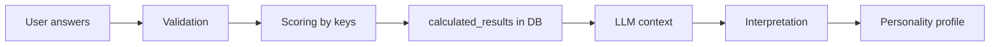
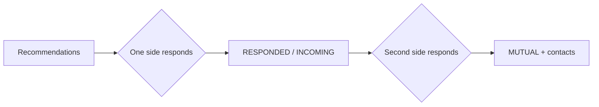

# ProCrush

Candidate matching platform: seekers take personality surveys and receive an interpreted profile; employers create job profiles and browse candidates.

## Service logic

### Roles

After sign-in, the user chooses a role once (`SEEKER` or `EMPLOYER`) via `POST /api/auth/complete-registration`. The role cannot be changed.

| Role | Capabilities |
|------|--------------|
| **Seeker (SEEKER)** | Takes personality test groups, receives an interpreted profile, specifies desired occupations, views job recommendations, and responds to them |
| **Employer (EMPLOYER)** | Manages company and job profiles, views recommended candidates with match scores, and responds to them |

### Test groups

Surveys are split into two groups:

1. **Test 1 (`core`)** — eight sequential assessments (open questions, quality selection, DISC, dilemmas, Belbin, etc.). Steps can be revisited until the entire group is completed.
2. **Test 2 (`64qn`)** — 64-question personality questionnaire (0–4 scale). Unlocks only after the `core` group is fully completed.

Locking and navigation rules between steps are implemented on the backend — see [backend/README.md](./backend/README.md).

### Pipeline: tests → scoring → interpretation

**1. Tests.** The seeker answers questions in the web client. Answers are saved as they go; on survey completion the server checks completeness and correctness.

**2. Scoring.** Each survey stores scoring keys in the DB. The server applies the appropriate logic (`open_text`, `matrix`, `direct_sum`, `formula`) and writes structured JSON to `survey_results.calculated_results`. Examples: DISC axis sums, Belbin roles, normalized 0–4 scale scores.

**3. Interpretation.** When both test groups are completed, the API enqueues a job; the separate **personality** process picks it up and calls the LLM:

- context is assembled: answers, scoring results, and a glossary of terms;
- the LLM receives a system prompt with the required JSON schema;
- the response is validated and saved as the personality profile.

Profile statuses: `NOT_READY` → `PROCESSING` → `READY` or `FAILED` (with retry). Profile readiness is pushed to the client in real time (SSE).

### Matching and responses

After both test groups are completed, the seeker specifies desired occupations. The employer creates job profiles linked to an occupation, skills, and expected personality axes.

**Recommendations.** The separate **matching** service is the sole source of recommendations: the API reads them over HTTP. Seeker ↔ job pairs are matched within the same occupation; the match score combines skill overlap (Jaccard) and, when the seeker's personality profile is ready, personality axis similarity (50/50). Lists are sorted by score descending.

| Side | Recommendation list |
|------|---------------------|
| Seeker | `GET /api/seeker/recommendations` — jobs for desired occupations |
| Employer | `GET /api/employer/job-profiles/{id}/candidates` — candidates for a job |

**Responses.** Either side can express interest first; a response is irreversible. Status is stored in `job_match_interests` and computed separately for each side:

| Status | For initiator | For recipient |
|--------|---------------|---------------|
| `NONE` | No response yet | — |
| `RESPONDED` | Own response sent | — |
| `INCOMING` | — | The other side responded |
| `MUTUAL` | Mutual interest | Mutual interest |

On `MUTUAL`, the other party's contact details are revealed. Responses outside the current recommendation list are available separately (`GET /api/seeker/interests`, `GET /api/employer/job-profiles/{id}/interests`).

New incoming responses are delivered in real time via SSE; unread count — `GET .../match-interests/count`.

## Module documentation

| Module | Description |
|--------|-------------|
| [backend/](./backend/README.md) | Kotlin backend: modules, infrastructure (Redis, RabbitMQ, Kafka), auth, local run |
| [frontend/](./frontend/README.md) | React web client: development and build |
| [openapi/](./openapi/README.md) | REST API contract (OpenAPI 3.1), codegen for backend and frontend |
| [i18n/](./i18n/README.md) | API error codes and UI translations (ru/en) |
| [deploy/](./deploy/README.md) | Deployment: Railway (cloud) and link to local Kubernetes |
| [deploy/k8s/](./deploy/k8s/README.md) | Local full stack in kind (Kubernetes) |
