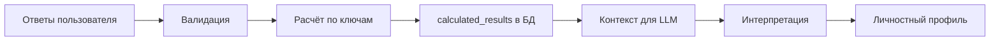
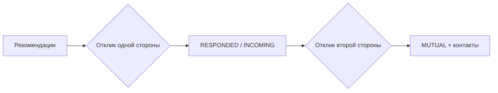

# ProCrush

Платформа подбора кандидатов: соискатель проходит личностные опросы, получает интерпретированный профиль; работодатель создаёт профили вакансий и просматривает кандидатов.

## Логика работы сервиса

### Роли

После входа пользователь один раз выбирает роль (`SEEKER` или `EMPLOYER`) через `POST /api/auth/complete-registration`. Сменить роль нельзя.

| Роль | Возможности |
|------|-------------|
| **Соискатель (SEEKER)** | Проходит группы личностных тестов, получает интерпретированный профиль, указывает желаемые профессии, просматривает рекомендации вакансий и откликается на них |
| **Работодатель (EMPLOYER)** | Ведёт профиль компании и профили вакансий, просматривает рекомендованных кандидатов с оценкой совпадения и откликается на них |

### Группы тестов

Опросы делятся на две группы:

1. **Тест 1 (`core`)** — восемь последовательных методик (открытые вопросы, выбор качеств, DISC, дилеммы, Белбин и др.). Шаги можно пересматривать, пока вся группа не завершена.
2. **Тест 2 (`64qn`)** — личностный опросник на 64 вопроса (шкала 0–4). Открывается только после полного завершения группы `core`.

Правила блокировки и навигации между шагами — в `backend/contracts/.../survey/SurveyFlowRules.kt`.

### Цепочка «тесты → расчёты → интерпретация»



**1. Тесты.** Соискатель отвечает на вопросы в веб-клиенте. Ответы сохраняются по мере заполнения; при завершении опроса сервер проверяет полноту и корректность (`SurveyAnswerValidator`).

**2. Расчёты.** Для каждого опроса в БД хранятся ключи подсчёта (`survey_keys`). `SurveyScoringService` применяет нужную логику (`open_text`, `matrix`, `direct_sum`, `formula`) и записывает структурированный JSON в `survey_results.calculated_results`. Примеры: суммы по осям DISC, роли Белбина, нормализованные баллы шкалы 0–4.

**3. Интерпретация.** Когда завершены обе группы тестов, API ставит задачу в очередь RabbitMQ; отдельный процесс **personality** забирает задачу и вызывает LLM:

- собирается контекст: ответы, результаты расчётов и глоссарий терминов (`SurveyService.buildLlmContext`);
- LLM получает системный промпт с требуемой JSON-схемой (`PersonalityPromptBuilder`);
- ответ валидируется и сохраняется (`PersonalityProfileValidator`, `SeekerPersonalProfileRepository`).

Статусы профиля: `NOT_READY` → `PROCESSING` → `READY` или `FAILED` (с возможностью повтора). Готовность профиля уведомляется клиенту через SSE (`/api/seeker/personality-preview/events`) и Redis pub/sub (работает при API и worker на разных процессах).

### Матчинг и отклики

После завершения обеих групп тестов соискатель указывает желаемые профессии. Работодатель создаёт профили вакансий с привязкой к профессии, навыкам и ожидаемым личностным осям.

**Рекомендации.** Отдельный сервис **matching** (`backend/matching`) — единственный источник рекомендаций: API читает их по HTTP (`MATCHING_SERVICE_URL` обязателен). Пары «соискатель ↔ вакансия» подбираются в рамках совпадающей профессии; оценка совпадения (`MatchScoringService`) — доля пересечения навыков (Jaccard) и, если у соискателя готов личностный профиль, сходство по осям личности (50/50). Списки сортируются по убыванию score.

| Сторона | Список рекомендаций |
|---------|---------------------|
| Соискатель | `GET /api/seeker/recommendations` — вакансии по желаемым профессиям |
| Работодатель | `GET /api/employer/job-profiles/{id}/candidates` — кандидаты для вакансии |

**Отклики.** Любая сторона может первой выразить интерес; отклик необратим. Статус хранится в `job_match_interests` и вычисляется для каждой стороны отдельно (`InterestStatusCalculator`):

| Статус | Для инициатора | Для получателя |
|--------|----------------|----------------|
| `NONE` | Отклика не было | — |
| `RESPONDED` | Свой отклик отправлен | — |
| `INCOMING` | — | Противоположная сторона откликнулась |
| `MUTUAL` | Взаимный интерес | Взаимный интерес |

При `MUTUAL` раскрываются контактные данные противоположной стороны. Отклики вне текущего списка рекомендаций доступны отдельно (`GET /api/seeker/interests`, `GET /api/employer/job-profiles/{id}/interests`).

Новые входящие отклики доставляются в реальном времени через SSE (`/api/seeker/match-interests/events`, `/api/employer/match-interests/events`); счётчик непросмотренных — `GET .../match-interests/count`.



## Выбор архитектуры

### React для веб-клиента

Веб-интерфейс реализован как **отдельное React + Vite + Tailwind приложение** (`frontend`):

- быстрый старт и знакомый стек для итераций UI;
- независимый деплой фронтенда (nginx + прокси `/api`);
- меньше связанности с Gradle при активной доработке экранов опросов и профиля.

## Структура репозитория

| Путь | Назначение                                     |
|------|------------------------------------------------|
| [`frontend/`](./frontend) | Основной веб-клиент (React)                    |
| [`openapi/`](./openapi) | **Единый контракт REST API** (OpenAPI 3.1): `specs/` — исходники, `dist/openapi.yaml` — bundle для фронта |
| [`backend/contracts/`](./backend/contracts/src/main/kotlin) | DTO для доменного слоя, события, порты и чистая доменная логика (синхронизируются с OpenAPI через `ApiMappers` в `backend/api`) |
| [`backend/config/`](./backend/config/src/main/kotlin) | Чтение env и типизированные настройки приложений |
| [`backend/platform/`](./backend/platform) | Redis, RabbitMQ, Kafka, LLM, Flyway main DB (`persistence`) |
| [`backend/domain/`](./backend/domain) | Bounded contexts: auth, seeker, employer, survey, matching, personality (репозитории, сервисы, Exposed-таблицы) |
| [`backend/api/`](./backend/api/src/main/kotlin) | Ktor HTTP API, Spektor-generated routes/DTO в `build/`, handlers, composition root |
| [`backend/personality/`](./backend/personality) | Gradle `:backend:personality` — deployable app: RabbitMQ consumer + health endpoint |
| [`backend/domain/personality/`](./backend/domain/personality) | Gradle `:backend:domain:personality-lib` — библиотека домена (координатор, publisher, worker-логика) |
| [`backend/matching/`](./backend/matching) | Kafka consumer + HTTP read API, отдельная БД матчинга |
| [`deploy/`](./deploy) | Dockerfile для Railway, Kubernetes (kind) для локального стека |

## Контракт API (OpenAPI)

Публичный REST API фронт ↔ бэк описан в [`openapi/`](./openapi/). Это единственный источник истины для путей, тел запросов и ответов.

```
openapi/
  specs/           # YAML-файлы (модели + paths), сканируются Spektor
  bundle.yaml      # entry point для Redocly
  dist/openapi.yaml  # bundled spec — коммитится, используется фронтом
```

| Слой | Генерация | Куда попадает |
|------|-----------|---------------|
| **Бэкенд** | Spektor (Gradle) | `backend/api/build/spektor-generated/` — routes, `*ServerApi`, DTO |
| **Фронтенд** | `openapi-typescript` | `frontend/src/api/generated/schema.d.ts` |

**Не входят в OpenAPI** (ручные Ktor routes): `GET /`, `GET /health`, три SSE-эндпоинта (`/match-interests/events`, `/personality-preview/events`). Internal API matching (`/internal/*`) — отдельно.

### Workflow: новый или изменённый эндпоинт

1. Правка YAML в `openapi/specs/` (модели и paths).
2. Бэкенд: `./gradlew :backend:api:compileKotlin` — Spektor перегенерирует код в `build/`.
3. Реализовать или обновить handler в `backend/api/.../api/handler/` (маппинг generated DTO ↔ домен через `api/mapper/ApiMappers.kt`).
4. Фронтенд:
   ```bash
   cd frontend
   npm run bundle:openapi && npm run generate:api
   ```
5. Закоммитить `openapi/dist/openapi.yaml` и `frontend/src/api/generated/schema.d.ts`.

После `git clone` перед работой с handlers: один раз `./gradlew :backend:api:compileKotlin`, чтобы IDE увидела generated sources в `build/`. В IntelliJ: *Build and run using → Gradle*.

## Локальная разработка

### Требования

- **Полный стек в Kubernetes (рекомендуется):** Docker (≥ 8 GB RAM), [kind](https://kind.sigs.k8s.io/), kubectl — см. [deploy/k8s/README.md](./deploy/k8s/README.md)
- **Hot-reload (опционально):** JDK 17+, Node.js 20+ для `./gradlew run` / `npm run dev`; инфраструктура kind доступна по loopback-IP `127.10.0.x` (см. [deploy/k8s/README.md](./deploy/k8s/README.md))

### Запуск полного стека (kind)

1. Из корня репозитория запустите kind (см. [deploy/k8s/README.md](./deploy/k8s/README.md)):

   ```bash
   chmod +x deploy/k8s/scripts/*.sh
   ./deploy/k8s/scripts/kind-up.sh
   ```

2. Откройте http://127.10.0.10 — dev-вход (`AUTH_DEV_MODE=true`).

Подробности, пересборка образов и устранение неполадок — в [deploy/k8s/README.md](./deploy/k8s/README.md).

Схема БД и справочные данные — в Flyway-миграциях (`backend/platform/persistence/src/main/kotlin/db/migration/`) и seed (`backend/platform/persistence/src/main/resources/db/seed/init_inserts.sql`). Сброс данных в kind:

```bash
kubectl delete namespace procrush
kubectl apply -k deploy/k8s/overlays/kind
```

### Аутентификация

Используются **httpOnly session cookies**. В kind-стеке включён dev-вход (`AUTH_DEV_MODE=true`).

| Endpoint | Описание |
|----------|----------|
| `POST /api/auth/dev/login` | Dev-вход (требует `AUTH_DEV_MODE=true`) |
| `GET /api/auth/me` | Текущий пользователь |
| `POST /api/auth/logout` | Выход |
| `POST /api/auth/complete-registration` | Выбор роли (неизменяемо) |

### Redis (обязателен)

Backend использует **Redis 8** для:

- кэша рекомендаций (cache-aside, TTL 10 мин);
- distributed lock при LLM-генерации личностного профиля (держит worker);
- кэша сессий (PostgreSQL остаётся source of truth);
- pub/sub для SSE-уведомлений о новых откликах и статусе генерации профиля (работает при нескольких инстансах API).

В kind Redis поднимается внутри кластера; с хоста доступен через `127.10.0.13:6379` (см. [deploy/k8s/README.md](./deploy/k8s/README.md)).

### RabbitMQ (обязателен)

**RabbitMQ** — брокер сообщений: API кладёт задачу «сгенерировать личностный профиль» в очередь `personality.generation`; worker забирает задачу и вызывает LLM.

- В kind: сервис `rabbitmq` в namespace `procrush`; UI — http://127.10.0.14:15672 (`procrush` / `procrush`)
- При ошибках после 3 попыток сообщение попадает в DLQ `personality.generation.dlq`

Проверка API (через Ingress): `GET http://127.10.0.10/api/...` или health напрямую: `kubectl port-forward -n procrush svc/api 8080:8080` → `GET http://localhost:8080/health`.

#### Статус Этапа 3 (RabbitMQ + personality)

Этап 3 **завершён**: API ставит задачи в очередь, отдельный процесс `personality` потребляет их, LLM вызывается вне API.

| Критерий | Статус |
|----------|--------|
| Publisher в API | `PersonalityGenerationCoordinator` → `PersonalityJobPublisher` |
| Отдельный worker | модуль `backend/personality`, Dockerfile `deploy/Dockerfile.personality` |
| Consumer только в worker | `AppContext` не стартует consumer; `WorkerContext` — да |
| Retry + DLQ | до 3 попыток, затем `personality.generation.dlq` |
| Distributed lock + dedup | Redis lock и `PersonalityMessageDedup` |
| SSE / pub-sub | `RedisPersonalityStatusNotifier` + SSE |

**Известные пробелы (не блокируют Этап 4):** нет end-to-end теста «publish → consume → READY».

### Kafka + matching (Этап 4)

**Kafka** — event log для пересчёта матчинга. API и personality публикуют доменные события; **matching** потребляет их и пишет результаты в **отдельную PostgreSQL** (`procrush_matching`).

- В kind: сервисы `kafka`, `matching-postgres`, `matching` в namespace `procrush`
- API читает рекомендации из matching по HTTP (`MATCHING_SERVICE_URL` обязателен)

Проверка matching: `kubectl port-forward -n procrush svc/matching 8092:8092` → `GET http://localhost:8092/health`.

### Запуск приложений (hot-reload, опционально)

При port-forward инфраструктуры на localhost (см. [deploy/k8s/README.md](./deploy/k8s/README.md); переменные — в [`deploy/k8s/base/configmap.yaml`](./deploy/k8s/base/configmap.yaml) и локальном [`secret.yaml`](./deploy/k8s/base/secret.yaml), скопированном из [`secret.yaml.example`](./deploy/k8s/base/secret.yaml.example)):

- **React:** `cd frontend && npm run dev` → http://localhost:8081
- **API**: `./gradlew :backend:api:run`
- **Personality**: `./gradlew :backend:personality:run`
- **Matching**: `./gradlew :backend:matching:run`

---

## Деплой на Railway (GitHub)

В одном проекте Railway девять сервисов: **Postgres**, **Matching Postgres**, **Redis**, **RabbitMQ**, **Kafka**, **Backend** (Ktor API), **Personality**, **Matching**, **Frontend** (React + nginx). Пользователи открывают только URL фронтенда; nginx проксирует `/api/*` на backend по приватной сети Railway.

### Архитектура

| Сервис | Root Directory | Config file (от корня репо) |
|--------|----------------|----------------------------|
| Backend | **пусто** (корень репо) | `/railway.toml` |
| Personality | **пусто** | `/deploy/railway.personality.toml` |
| Matching | **пусто** | `/deploy/railway.matching.toml` |
| Frontend | **пусто** | `/deploy/railway.frontend.toml` |
| Postgres | — | — |
| Matching Postgres | — | — |
| Redis | — | — |
| RabbitMQ | — | — (Railway template / Docker image) |
| Kafka | — | — (Railway template / Redpanda / Upstash) |

Образы собираются **из корня репозитория** (backend — `backend/`; frontend — `deploy/Dockerfile.frontend`).

Для backend **не используйте** Railpack/Nixpacks auto-detect — только `builder = "DOCKERFILE"` в конфиге.

Имена сервисов в `${{...}}` **чувствительны к регистру** (например, `Backend`, `Frontend`, `Postgres`).

### Подключение GitHub

1. Создайте пустой репозиторий на GitHub (аккаунт, связанный с Railway).
2. Запушьте проект:

```powershell
cd C:\path\to\procrush
git remote add origin https://github.com/<user>/<repo>.git
git push -u origin master
```

Используйте `main` вместо `master`, если это ветка по умолчанию на GitHub.

### Настройка в Railway (один раз)

В проекте уже должен быть **Postgres**. Добавьте два application-сервиса и подключите к каждому **тот же** GitHub-репозиторий и ветку.

#### Backend

1. **+ New** → **Empty Service** → имя `Backend`.
2. **Settings → Source**: GitHub-репозиторий и ветка.
3. **Settings → Root Directory**: **пусто**.
4. **Settings → Config file**: `/railway.toml`.
5. **Variables**:

   | Переменная | Значение |
   |------------|----------|
   | `DATABASE_URL` | `${{Postgres.DATABASE_URL}}` |
   | `REDIS_URL` | `${{Redis.REDIS_URL}}` |
   | `RABBITMQ_URL` | `${{RabbitMQ.RABBITMQ_URL}}` (или URL вашего RabbitMQ-сервиса) |
   | `WEB_ORIGIN` | `https://${{Frontend.RAILWAY_PUBLIC_DOMAIN}}` (после появления домена у frontend) |
   | `FRONTEND_URL` | то же, что `WEB_ORIGIN` |
   | `AUTH_DEV_MODE` | `false` (prod) или `true` (staging) |

6. Деплой (автоматически при push или **Deploy** в dashboard).
7. Публичный домен опционален (health: `GET /health`).

#### Personality

1. **+ New** → **Empty Service** → имя `Personality`.
2. **Settings → Source**: **тот же** репозиторий и ветка.
3. **Settings → Root Directory**: **пусто**.
4. **Settings → Config file**: `/deploy/railway.personality.toml`.
5. **Variables**:

   | Переменная | Значение |
   |------------|----------|
   | `DATABASE_URL` | `${{Postgres.DATABASE_URL}}` |
   | `REDIS_URL` | `${{Redis.REDIS_URL}}` |
   | `RABBITMQ_URL` | `${{RabbitMQ.RABBITMQ_URL}}` |
   | `LLM_BASE_URL` | `https://generativelanguage.googleapis.com/v1beta/openai` |
   | `LLM_MODEL` | `gemini-3.1-flash-lite` |
   | `LLM_API_KEY` | ключ провайдера (Gemini / OpenRouter и т.д.) |
   | `WORKER_HEALTH_PORT` | `8091` локально; на Railway можно не задавать — используется `PORT` |

6. **Networking → Public Networking**: опционально (health: `GET /health` на порту worker).
7. Деплой.

#### Frontend

1. **+ New** → **Empty Service** → имя `Frontend`.
2. **Settings → Source**: **тот же** репозиторий и ветка.
3. **Settings → Root Directory**: **пусто**.
4. **Settings → Config file**: `/deploy/railway.frontend.toml`.
5. **Variables**:

   | Переменная | Значение |
   |------------|----------|
   | `BACKEND_UPSTREAM` | `${{Backend.RAILWAY_PRIVATE_DOMAIN}}:8080` |

   Используйте точные имена сервисов. **Не** используйте `${{Backend.PORT}}` — cross-service ссылки на `PORT` часто пустые, nginx падает с `invalid port in upstream`.

   API слушает порт `8080` (`deploy/Dockerfile.api`, Ktor по умолчанию без `PORT`).

6. **Networking → Public Networking**: **Generate Domain** (обязательно для пользователей).
7. Деплой.

#### После появления URL у frontend

Если `WEB_ORIGIN` / `FRONTEND_URL` не были заданы через `${{Frontend.RAILWAY_PUBLIC_DOMAIN}}` до создания домена — установите их и передеплойте **Backend**.

### Порядок деплоя

1. Postgres (уже создан)
2. Redis, RabbitMQ
3. Backend (`/health`, Flyway в логах)
4. Personality (`/health`, consumer в логах)
5. Frontend (публичный домен + `BACKEND_UPSTREAM`)
6. Повторный деплой Backend, если нужно обновить `WEB_ORIGIN` / `FRONTEND_URL`

### Проверка

| Проверка | Как |
|----------|-----|
| Health API | `GET /health` → `{"status":"ok","redis":"ok","rabbitmq":"ok"}` |
| Health Worker | `GET http://<worker-domain>/health` (порт сервиса на Railway) |
| Frontend | `https://<frontend-domain>/` |
| API через прокси | Вход при `AUTH_DEV_MODE=true` на backend |
| Сборка | В логах деплоя — **Dockerfile**, не **Railpack** |

### Railway vs локально

- В контейнерах нет `.env` — переменные задаются в Railway dashboard.
- Railway выставляет `PORT` для обоих сервисов.
- `DATABASE_URL` от Postgres — `postgresql://...`; сервер добавляет JDBC `sslmode=require`.

Переменные LLM для **Personality** (`LLM_BASE_URL`, `LLM_API_KEY`, `LLM_MODEL` и др.). В kind: `LLM_BASE_URL` / `LLM_MODEL` — в [`deploy/k8s/base/configmap.yaml`](./deploy/k8s/base/configmap.yaml), `LLM_API_KEY` — в локальном [`deploy/k8s/base/secret.yaml`](./deploy/k8s/base/secret.yaml) (шаблон: [`secret.yaml.example`](./deploy/k8s/base/secret.yaml.example)).
