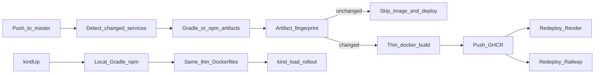

# ProCrush Deploy

One packaging model for every environment: **host/CI builds artifacts, Docker only packages them**.

| Path | Purpose |
|------|---------|
| [`docker/`](./docker/) | Thin Dockerfiles shared by kind, GHCR CI, Render, and Railway |
| [`render/`](./render/README.md) | Render Blueprint (`runtime: image`) + secrets |
| [`railway/`](./railway/README.md) | Railway image-backed services + infra notes |
| [`k8s/`](./k8s/README.md) | Local full stack in kind (Kubernetes) |

## Packaging model



- **Build outside Docker** — Gradle `installDist` (api/matching), `linkReleaseExecutableLinuxX64` (personality Native `.kexe`), / `frontendBuild` on the host or GitHub Actions runner.
- **Thin images** — each `deploy/docker/Dockerfile.*` only copies a prebuilt artifact tree onto a runtime base image.
- **Registry** — `ghcr.io/<owner>/procrush-<service>:<git-sha>` plus moving `:master`.
- **Cloud** — Render and Railway pull those images (no platform Dockerfile build).
- **Local** — `./gradlew kindUp` uses the same Dockerfiles with hash-gated rebuilds.

## Local development (kind)

```bash
./gradlew kindUp
```

Open http://127.10.0.10 — dev login (`AUTH_DEV_MODE=true`). Details: [k8s/README.md](./k8s/README.md).

## Cloud deploy (master)

Push to `master` runs [`.github/workflows/deploy-master.yml`](../.github/workflows/deploy-master.yml):

1. Detect changed services from the path map (fallback: all four).
2. Build artifacts only for selected services.
3. Fingerprint artifact tree + Dockerfile (same idea as `KindSupport.artifactFingerprint`); skip when Actions cache hits.
4. Build/push thin images to GHCR with `GITHUB_TOKEN`.
5. Redeploy each pushed service to Render (deploy hooks) and Railway (token + service IDs).

GHCR packages are public with the public repo so platforms can pull without registry credentials.

### Required GitHub Actions secrets

| Secret | Purpose |
|--------|---------|
| `RENDER_DEPLOY_HOOK_API` | Render deploy hook URL for api |
| `RENDER_DEPLOY_HOOK_PERSONALITY` | Render deploy hook URL for personality |
| `RENDER_DEPLOY_HOOK_MATCHING` | Render deploy hook URL for matching |
| `RENDER_DEPLOY_HOOK_FRONTEND` | Render deploy hook URL for frontend |
| `RAILWAY_TOKEN` | Railway project token (scoped environment) |
| `RAILWAY_SERVICE_ID_API` | Railway service id for api |
| `RAILWAY_SERVICE_ID_PERSONALITY` | Railway service id for personality |
| `RAILWAY_SERVICE_ID_MATCHING` | Railway service id for matching |
| `RAILWAY_SERVICE_ID_FRONTEND` | Railway service id for frontend |

`GITHUB_TOKEN` is provided by Actions for GHCR push (`packages: write`).

## Related documentation

- [render/README.md](./render/README.md) — Render Blueprint and deploy hooks
- [railway/README.md](./railway/README.md) — Railway image sources and variables
- [k8s/README.md](./k8s/README.md) — local Kubernetes (kind)
- [backend/README.md](../backend/README.md) — backend and infrastructure dependencies
- [frontend/README.md](../frontend/README.md) — web client
